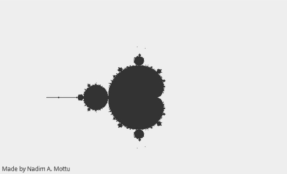

# Making-Mandelbrot

A simple Java application to visualize the **Mandelbrot Set**. This project demonstrates complex number iteration and fractal generation using Java.

## Screenshot

## Features

* Real-time rendering of the Mandelbrot set
* Adjustable parameters (e.g., iteration depth, color mapping)
* Lightweight and responsive GUI using Java Swing / JavaFX

### Prerequisites

* Java 11 or higher
* A Java IDE (e.g., IntelliJ IDEA, Eclipse) or `javac` command-line tool

## How It Works

The Mandelbrot set is generated by iterating the function:

> `z = z² + c`

For each pixel, the algorithm determines whether the sequence remains bounded. The number of iterations before divergence determines the pixel color.

## Acknowledgments

* Benoît B. Mandelbrot for the inspiration
* Java’s powerful GUI libraries
* [Wikipedia](https://en.wikipedia.org/wiki/Mandelbrot_set) for reference material

